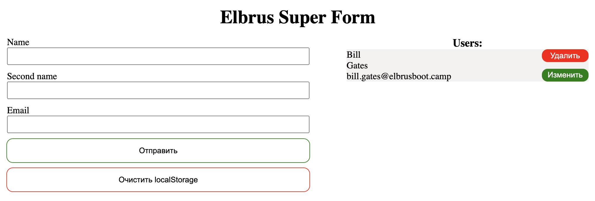

# Elbrus Super Form

Перед тем, как начать писать код:
1) Изучите код в `index.css`, `index.js` и `index.html`.
2) Откройте `index.html` файл в браузере и изучите UI приложения (пользовательский интерфейс). Посмотрите, как хранятся данные в `localStorage`.

## Важно
1) Нельзя форматировать весь код в приложении. Настройте `prettier` и `eslint`, чтобы настройки использовались из файлов `.prettierrc.json` и `.eslintrc.js`.
2) Не удаляйте и не комментируйте написанный код. Это может привести к новым багам. Приложение работает, вам только нужно добавить код.
3) Нельзя переиспользовать функции `addCard` и `rerenderCards`.

## Релиз 0
- Установите все зависимости. Выполните команду `npm i` в терминале.

## Релиз 1
В этом релизе вам нужно поправить баг, который появился с последним обновлением. Ниже приложен скриншот до появления бага.

### Фактический результат:
- При клике на кнопку `Отправить`, данные из формы не добавляются в список `Users` (в браузере) и в `localStorage`   

### Ожидаемый результат:
- При клике на кнопку `Отправить`, данные из формы должны добавляться в список `Users` (в браузере) и в `localStorage`

### Комментарии стажёра-разработчика, который работал над обновлением:
- Работал над этой задачей недавно. Точно помню, что в одном месте удалил вызов функции `createCard`, когда делал дебаг. Похоже, что забыл вернуть ее обратно. Функция аналогично вызывалась где-то еще.

## Релиз 2
- По клику на кнопку `Удалить` нужно удалить карточку из списка `Users` (в браузере) и из `localStorage`

## Релиз 3
- По клику на кнопку `Изменить` данные из карточки должны появиться в соответствующих полях формы, чтобы можно было добавить или обновить карточку. 
- **Добавляем** новую карточку, **если** поменяли `email` и **обновляем** карточку, **если** `email` не изменился. 
- Не забудьте сделать проверку в функции `addCard`, что `email`, который вы хотите добавить, есть в `storage`. 

## Релиз 4
Добавьте новые поля, поменяйте шрифт, обновите стили и разместите свою работу на `GitHub pages`.
